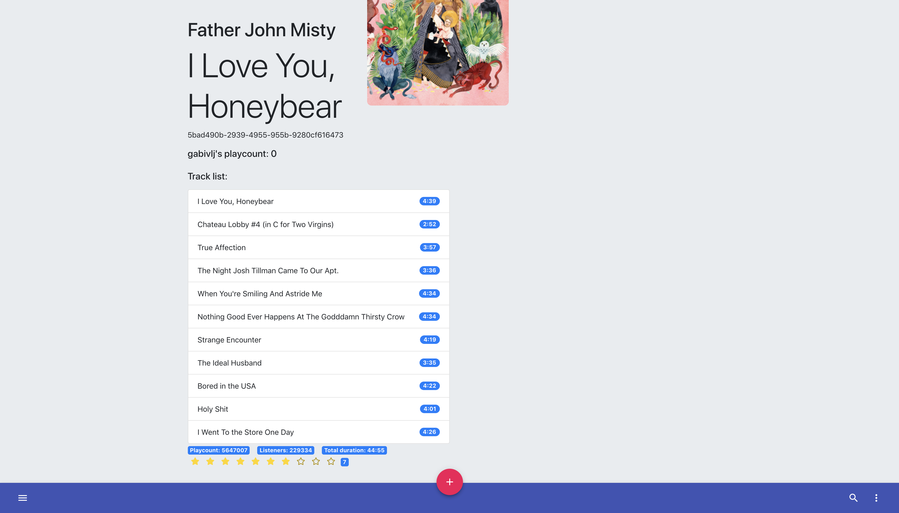
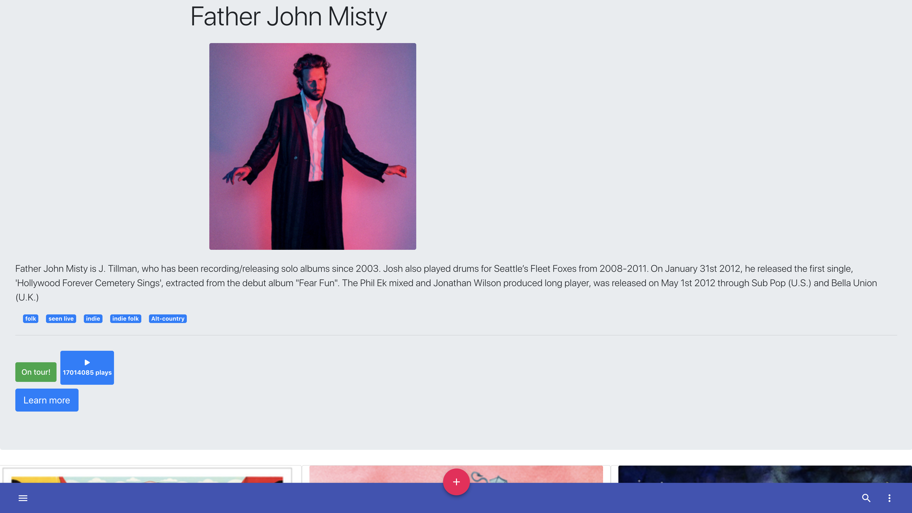
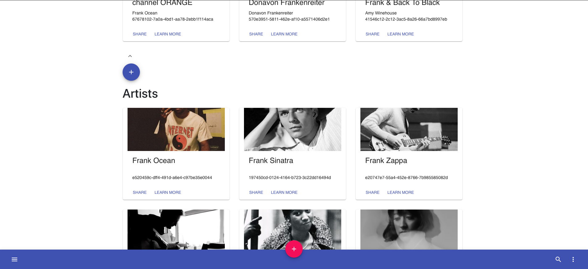

# Grampy, a music social network!

## Rate your favorite music, share your reviews and rating with other people!

### Using Lastfm database, Go/mux, Node.js, Express.js, Mongodb and React.js.

I chose this tech stack because it's what I'm confortable with.

### Why a music rater?

A: Because current music pages for that purpose are not that good.
Sonemic is not gonna be released anytime soon, of course I chose this project because I like music and challenges.

### When will it be available for use?

I don't know, when it has the features that I think it needs as a MINIMUM, I will publish it.

## Installation

- Download the repo.
  `npm install`
  `npm run server`
  `cd client && npm start`

## More information

- Made by Gabriel Villalonga Simón
- Logo made by Alvaro Tomás Lozano @AbsydeAuberon
- If you wanna contribute to this project contact me, I'd love to collaborate with anyone.
- Any questions regarding code or something, just ask me.

## Screenshots ( OUTDATED )

