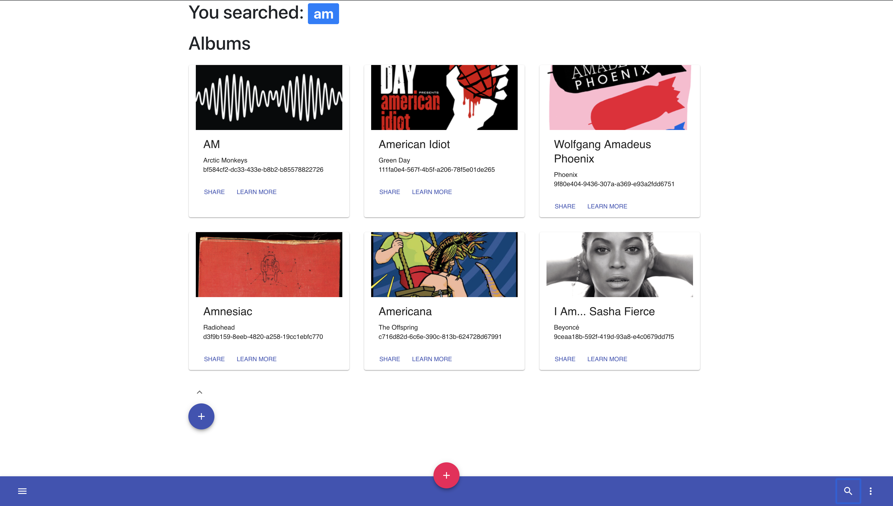

# LASTFMRater

## Rate your favorite music, share your reviews and rating with other people!

### Using LASTFM Api. Node.js, Express, Mongodb and React.js.

### Why a music rater?

A: Because current music pages for that purpose are not that good.

## Installation

- Download the repo.
  `npm install`
  `npm run server`
  `cd client && npm start`

## More information

- Made by Gabriel Villalonga Simón
- If you wanna contribute to this project contact me, I'd love to collaborate with anyone.
- Any questions regarding code or something, just ask me.

## Screenshots

